# 🚀 Logistics CI/CD Pipeline


A professional-grade CI/CD pipeline implementation for a Python Logistics application using GitHub Actions. This project demonstrates enterprise-level DevOps practices including automated testing, containerization, and continuous deployment.

## 📋 Table of Contents

- [Overview](#overview)
- [Features](#features)
- [Architecture](#architecture)
- [Tech Stack](#tech-stack)
- [Prerequisites](#prerequisites)
- [Getting Started](#getting-started)
- [Running Tests](#running-tests)
- [Docker Usage](#docker-usage)
- [CI/CD Pipeline](#cicd-pipeline)
- [API Documentation](#api-documentation)
- [Configuration](#configuration)
- [Deployment](#deployment)
- [Contributing](#contributing)
- [License](#license)

## 🎯 Overview

This project implements a complete logistics management system with the following capabilities:

- **Shipment Tracking**: Create and track shipments with real-time location updates
- **Inventory Management**: Manage warehouse inventory with stock level tracking
- **Route Optimization**: Calculate optimal delivery routes
- **Order Management**: Create and track customer orders

The application is built with enterprise-grade DevOps practices, featuring a complete CI/CD pipeline that automates testing, building, and deployment.

## ✨ Features

### Application Features

- ✅ **RESTful API** with 15+ endpoints
- ✅ **Shipment Tracking** with location history
- ✅ **Inventory Management** with stock controls
- ✅ **Route Optimization** algorithm
- ✅ **Order Processing** system
- ✅ **Health Check** endpoint for monitoring
- ✅ **Environment-based Configuration**
- ✅ **Comprehensive Error Handling**

### DevOps Features

- 🔄 **Automated Testing** on every commit
- 🐳 **Docker Containerization** with multi-stage builds
- 🚀 **GitHub Actions CI/CD** workflows
- 📊 **Code Coverage** reporting (>80%)
- 🔍 **Code Quality** checks (flake8)
- 🔒 **Security Scanning** (Trivy, pip-audit)
- 📦 **Container Registry** integration (ghcr.io)
- 🏗️ **Production-ready** deployment setup

## 🏗️ Architecture

```
logistics-ci-cd/
├── .github/
│   └── workflows/
│       ├── ci.yml          # Continuous Integration workflow
│       └── cd.yml          # Continuous Deployment workflow
├── app/
│   ├── app.py              # Main Flask application
│   ├── config.py           # Configuration management
│   ├── test_app.py         # Comprehensive test suite
│   └── requirements.txt    # Python dependencies
├── Dockerfile              # Multi-stage production Dockerfile
├── docker-compose.yml      # Local development setup
├── pytest.ini              # Pytest configuration
├── .flake8                 # Linting configuration
├── .env.example            # Environment variables template
└── README.md               # This file
```

### CI/CD Pipeline Architecture

```mermaid
graph LR
    A[Developer Push] --> B[GitHub Actions]
    B --> C{Branch?}
    C -->|Any Branch| D[CI Workflow]
    C -->|Main Branch| E[CD Workflow]
    D --> F[Lint Code]
    D --> G[Run Tests]
    D --> H[Security Audit]
    E --> I[Build Docker Image]
    E --> J[Push to Registry]
    E --> K[Security Scan]
    F --> L{Pass?}
    G --> L
    H --> L
    L -->|Yes| M[✅ Success]
    L -->|No| N[❌ Fail]
```



## 🛠️ Tech Stack

| Category | Technology |
|----------|------------|
| **Language** | Python 3.9+ |
| **Framework** | Flask 3.0.0 |
| **WSGI Server** | Gunicorn |
| **Testing** | pytest, pytest-cov |
| **Linting** | flake8 |
| **Containerization** | Docker, Docker Compose |
| **CI/CD** | GitHub Actions |
| **Container Registry** | GitHub Container Registry (ghcr.io) |
| **Security** | Trivy, pip-audit |

## 📦 Prerequisites

Before you begin, ensure you have the following installed:

- **Python 3.9 or higher**
- **Docker** (for containerization)
- **Docker Compose** (for local development)
- **Git** (for version control)

## 🚀 Getting Started

### 1. Clone the Repository

```bash
git clone https://github.com/yourusername/logistics-ci-cd.git
cd logistics-ci-cd
```

### 2. Set Up Python Environment

```bash
# Create virtual environment
python -m venv venv

# Activate virtual environment
# On Windows:
venv\Scripts\activate
# On macOS/Linux:
source venv/bin/activate

# Install dependencies
pip install -r app/requirements.txt
```

### 3. Configure Environment Variables

```bash
# Copy example environment file
cp .env.example .env

# Edit .env with your configuration
# (Use notepad, vim, or your preferred editor)
```

### 4. Run the Application

```bash
# Navigate to app directory
cd app

# Run Flask application
python app.py
```

The application will be available at `http://localhost:5000`

### 5. Verify Installation

```bash
# Test health endpoint
curl http://localhost:5000/health

# Expected response: {"status":"UP"}
```

## 🧪 Running Tests

### Run All Tests

```bash
cd app
pytest test_app.py -v
```

### Run Tests with Coverage

```bash
cd app
pytest test_app.py --cov=. --cov-report=term-missing --cov-report=html
```

View the HTML coverage report:
```bash
# Open htmlcov/index.html in your browser
```

### Run Specific Tests

```bash
cd app
pytest test_app.py::test_create_shipment_success -v
```

### Run Linting

```bash
flake8 app/ --max-line-length=120
```

## 🐳 Docker Usage

### Build Docker Image

```bash
docker build -t logistics-app:latest .
```

### Run Docker Container

```bash
docker run -d -p 5000:5000 --name logistics-app logistics-app:latest
```

### Using Docker Compose (Recommended for Development)

```bash
# Start application
docker-compose up -d

# View logs
docker-compose logs -f

# Stop application
docker-compose down
```

### Test Containerized Application

```bash
# Health check
curl http://localhost:5000/health

# Get service info
curl http://localhost:5000/
```

## 🔄 CI/CD Pipeline

### Continuous Integration (CI) Workflow

**Triggered on**: Every push and pull request

**Jobs**:
1. **Lint**: Code quality checks with flake8
2. **Test**: Run tests across Python 3.9, 3.10, 3.11, 3.12
3. **Security**: Dependency vulnerability scanning

**How to view results**:
- Go to your GitHub repository
- Click on "Actions" tab
- Select the CI workflow run

### Continuous Deployment (CD) Workflow

**Triggered on**: Push to `main` branch

**Jobs**:
1. **Build and Push**: Creates Docker image and pushes to ghcr.io
2. **Security Scan**: Scans Docker image for vulnerabilities
3. **Deploy Summary**: Provides deployment status

**Image naming convention**:
- `ghcr.io/username/logistics-ci-cd:latest`
- `ghcr.io/username/logistics-ci-cd:main-<sha>`

### Setting Up GitHub Actions

1. **Enable GitHub Actions** in your repository settings
2. **Set Repository Secrets** (if using external registries):
   - Go to Settings → Secrets and variables → Actions
   - Add required secrets (GitHub token is automatic)
3. **Enable GitHub Packages**:
   - Settings → Code and automation → Packages
   - Ensure visibility settings match your needs

### Branch Protection (Recommended)

Add branch protection rules for `main`:
1. Go to Settings → Branches
2. Add rule for `main` branch:
   - ✅ Require status checks before merging
   - ✅ Require branches to be up to date before merging
   - Select: CI Workflow checks

## 📚 API Documentation

### Base URL
```
http://localhost:5000
```

### Endpoints

#### Service Information

**GET /**
```bash
curl http://localhost:5000/
```

#### Health Check

**GET /health**
```bash
curl http://localhost:5000/health
```

#### Order Management

**POST /order** - Create an order
```bash
curl -X POST http://localhost:5000/order \
  -H "Content-Type: application/json" \
  -d '{"order_id":"ORD-001","customer":"John Doe","items":["item1","item2"]}'
```

**GET /order/:order_id** - Get order details
```bash
curl http://localhost:5000/order/ORD-001
```

#### Shipment Tracking

**POST /shipment** - Create a shipment
```bash
curl -X POST http://localhost:5000/shipment \
  -H "Content-Type: application/json" \
  -d '{
    "shipment_id":"SHP-001",
    "origin":"New York",
    "destination":"Los Angeles",
    "estimated_delivery":"2026-02-20"
  }'
```

**GET /shipment/:shipment_id** - Get shipment status
```bash
curl http://localhost:5000/shipment/SHP-001
```

**PUT /shipment/:shipment_id/location** - Update shipment location
```bash
curl -X PUT http://localhost:5000/shipment/SHP-001/location \
  -H "Content-Type: application/json" \
  -d '{"location":"Chicago","status":"in_transit"}'
```

**GET /shipments** - List all shipments
```bash
curl http://localhost:5000/shipments?status=pending
```

#### Inventory Management

**GET /inventory** - Get all inventory
```bash
curl http://localhost:5000/inventory
```

**POST /inventory** - Add inventory item
```bash
curl -X POST http://localhost:5000/inventory \
  -H "Content-Type: application/json" \
  -d '{
    "item_id":"ITM-001",
    "name":"Widget",
    "quantity":100,
    "location":"Warehouse A",
    "category":"Electronics"
  }'
```

**GET /inventory/:item_id** - Get specific item
```bash
curl http://localhost:5000/inventory/ITM-001
```

**PUT /inventory/:item_id/stock** - Update stock
```bash
curl -X PUT http://localhost:5000/inventory/ITM-001/stock \
  -H "Content-Type: application/json" \
  -d '{"quantity":150}'
```

#### Route Optimization

**POST /route/optimize** - Optimize delivery route
```bash
curl -X POST http://localhost:5000/route/optimize \
  -H "Content-Type: application/json" \
  -d '{
    "start":"New York",
    "waypoints":["Philadelphia","Baltimore"],
    "end":"Atlanta"
  }'
```

## ⚙️ Configuration

### Environment Variables

| Variable | Description | Default |
|----------|-------------|---------|
| `FLASK_ENV` | Environment (development/production) | `production` |
| `FLASK_DEBUG` | Enable debug mode | `false` |
| `SECRET_KEY` | Flask secret key | Auto-generated |

### Configuration Files

- **`.env`**: Local environment variables (not committed)
- **`.env.example`**: Template for environment variables
- **`app/config.py`**: Configuration classes for different environments

## 🚢 Deployment

### Deploy to Production

1. **Push to main branch**:
```bash
git checkout main
git merge your-feature-branch
git push origin main
```

2. **GitHub Actions will automatically**:
   - Run all tests
   - Build Docker image
   - Push to container registry
   - Scan for security vulnerabilities

3. **Pull and run the image**:
```bash
# Pull latest image
docker pull ghcr.io/username/logistics-ci-cd:latest

# Run in production
docker run -d \
  -p 5000:5000 \
  -e FLASK_ENV=production \
  -e SECRET_KEY=your-production-secret \
  --name logistics-prod \
  ghcr.io/username/logistics-ci-cd:latest
```

### Production Checklist

- [ ] Set strong `SECRET_KEY` environment variable
- [ ] Configure proper logging
- [ ] Set up database (if using persistent storage)
- [ ] Configure reverse proxy (nginx, etc.)
- [ ] Enable HTTPS
- [ ] Set up monitoring and alerts
- [ ] Configure backup strategy
- [ ] Review security settings

## 🤝 Contributing

We welcome contributions! Please see [CONTRIBUTING.md](CONTRIBUTING.md) for details.

### Quick Start for Contributors

1. Fork the repository
2. Create a feature branch: `git checkout -b feature/amazing-feature`
3. Make your changes
4. Run tests: `pytest app/test_app.py`
5. Run linting: `flake8 app/`
6. Commit changes: `git commit -m 'Add amazing feature'`
7. Push to branch: `git push origin feature/amazing-feature`
8. Open a Pull Request

## 📄 License

This project is licensed under the MIT License - see the [LICENSE](LICENSE) file for details.

## 🆘 Troubleshooting

### Common Issues

**Issue**: Tests fail with import errors
```bash
# Solution: Ensure you're in the app directory
cd app
pytest test_app.py
```

**Issue**: Docker build fails
```bash
# Solution: Clear Docker cache and rebuild
docker system prune -a
docker build --no-cache -t logistics-app .
```

**Issue**: Port 5000 already in use
```bash
# Solution: Use a different port
docker run -p 8080:5000 logistics-app
# Or find and stop the process using port 5000
```

**Issue**: GitHub Actions workflow fails
```bash
# Solution: Check the Actions tab for detailed logs
# Common fixes:
# 1. Ensure all tests pass locally
# 2. Check Python version compatibility
# 3. Verify all required files are committed
```

## 📞 Support

For issues, questions, or contributions, please:
- Open an issue on GitHub
- Review existing issues and discussions
- Check the documentation

## 🎓 Learning Resources

- [Flask Documentation](https://flask.palletsprojects.com/)
- [Docker Documentation](https://docs.docker.com/)
- [GitHub Actions Documentation](https://docs.github.com/en/actions)
- [pytest Documentation](https://docs.pytest.org/)

---

**Built with ❤️ for Enterprise DevOps Excellence**
